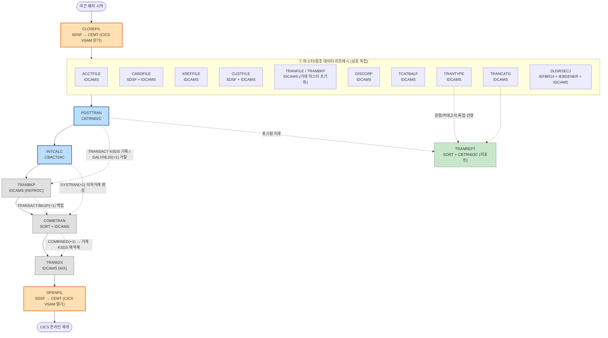

# CardDemo 야간 배치 사이클 흐름도 (Nightly Batch Flow)

> 근거: 루트 README "Running Batch Jobs" 표, `scripts/run_full_batch.sh`,
> 그리고 `docs/jcl/*.md` 각 잡의 선행/후행 의존성.
> 노드 표기 = `JCL잡명[JCL잡명\n실행프로그램]` (시스템 유틸리티는 IDCAMS/SORT/SDSF 등으로 병기).
> 핵심 흐름: **데이터 리프레시 → POSTTRAN → INTCALC → TRANBKP → COMBTRAN → TRANIDX → OPENFIL**.
> 경계: `CLOSEFIL`(CICS 파일 닫기)로 시작, `OPENFIL`(CICS 파일 열기)로 끝.

## 단계별 한 줄 설명

- **CLOSEFIL** (SDSF → CEMT): 배치 사이클의 경계 시작. CICS 리전이 잡고 있는 VSAM 파일(TRANSACT, CCXREF, ACCTDAT, CXACAIX, USRSEC)을 닫아 배치가 DISP=OLD/I-O로 독점 접근할 수 있게 한다.
- **① 마스터/참조 리프레시** (IDCAMS 군): 계정(ACCTFILE)·카드(CARDFILE)·교차참조(XREFFILE)·고객(CUSTFILE)·거래마스터(TRANFILE/TRANBKP)·공시그룹(DISCGRP)·카테고리잔액(TCATBALF)·거래유형(TRANTYPE)·거래카테고리(TRANCATG)·사용자보안(DUSRSECJ)을 평면 파일에서 VSAM KSDS로 재적재한다. 잡 간 직접 의존이 없어 병렬 실행이 가능하며, POSTTRAN이 읽을 마스터가 먼저 최신화되어야 한다.
- **POSTTRAN** (CBTRN02C): 일일 거래(DALYTRAN)를 한 건씩 검증(카드→계정 조회, 신용한도·만료일)하고 통과 건을 거래 마스터(TRANSACT KSDS)에 기록, 계정·카테고리 잔액을 갱신한다. 실패 건은 거절 파일 DALYREJS(+1)로 분리하고 거절 발생 시 RETURN-CODE=4.
- **INTCALC** (CBACT04C): 카테고리잔액(TCATBALF)을 계정ID 순으로 순차 스캔하며 control-break로 계정별 월 이자(`잔액×연율/1200`)를 계산해 계정 잔액에 반영(ACCTDATA REWRITE)하고, 생성한 이자 거래를 SYSTRAN(+1) 신규 세대에 기록한다.
- **TRANBKP** (IDCAMS/REPROC): 갱신된 거래 마스터(TRANSACT.VSAM.KSDS)를 GDG 백업(TRANSACT.BKUP(+1), 350B FB)으로 언로드한 뒤, KSDS를 삭제·빈 상태로 재정의한다.
- **COMBTRAN** (SORT + IDCAMS): 당일 백업(BKUP(0))과 시스템 이자거래(SYSTRAN(0))를 TRAN-ID 기준으로 병합·정렬(COMBINED(+1))한 뒤, 재정의된 빈 거래 KSDS에 REPRO로 다시 적재한다.
- **TRANIDX** (IDCAMS): 재적재된 거래 KSDS에 대해 대체 인덱스(AIX, 처리타임스탬프 기준)와 PATH를 재정의·재빌드한다. CICS가 AIX 경로(CXACAIX 등)로 거래를 조회할 수 있게 한다.
- **OPENFIL** (SDSF → CEMT): 배치 사이클의 경계 끝. 배치가 갱신한 VSAM 파일들을 CICS 리전에 다시 열어 온라인 트랜잭션(거래/계정/카드 조회 등)을 재개한다.

### 참고 (정규 사이클과 별개)

- **TRANREPT** (SORT + CBTRN03C): POSTTRAN 완료 후 TRANSACT를 소스로 일자 범위(DATEPARM) 거래 상세 리포트를 생성한다. 거래유형(TRANTYPE)·카테고리(TRANCATG) 룩업 파일이 선행되어야 한다. `run_full_batch.sh`의 핵심 7단계에는 포함되지 않으며, 리포트 발행 시점에 실행된다.
- **GDG 정의 선행 잡**: `DEFGDGB`(거래 백업/일별/통합·SYSTRAN·리포트 베이스), `DEFGDGD`(참조데이터 GDG), `REPTFILE`(리포트 GDG), `DALYREJS`(거절 GDG)는 사이클 이전에 1회성으로 GDG 베이스를 정의해 두어야 위 (+1) 세대 생성이 성공한다.
- **명세서 계열**: `CREASTMT`(CBSTM03A/B, 텍스트+HTML 명세서) → `TXT2PDF1`(PDF 변환)은 마스터 최신화 이후 별도 실행되는 발행 흐름이다.
- **주의(run_full_batch.sh)**: 스크립트는 리프레시 단계의 "Refresh Transaction Data"와 사이클 후반 "Backup transaction Data"에 모두 `TRANBKP.jcl`을 사용하므로, 동일 잡이 시퀀스에 두 번 등장한다(위 ① 박스의 TRANFILE/TRANBKP와 본 흐름의 TRANBKP).
